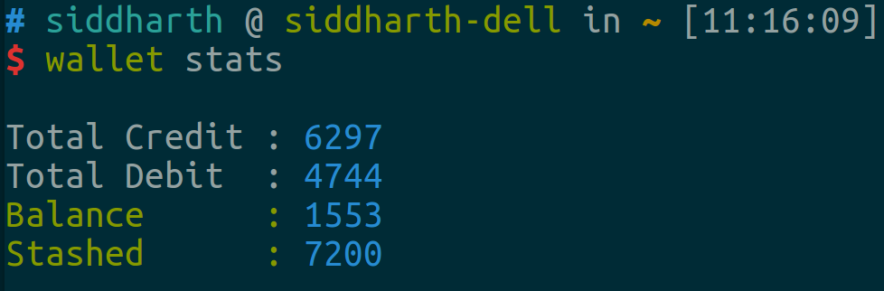

# terminal-wallet

## Who?

A wallet manager is something that everyone has to use. A lot of people prefer
to use an
[Android](https://play.google.com/store/apps/details?id=com.greyblue.expensetracker)
[app](https://play.google.com/store/apps/details?id=com.daamitt.walnut.app) for
expense tracking.

I spend most of my time on a Linux computer and a terminal is always open. It
made perfect sense to me to maintain my daily expense tracking needs from within
the terminal, with just text based commands. 

## So?

This module is my effort to solve that. It's nowhere near feature-complete, but
the features that are in it work perfectly well. That's what I was going for.
Eventually, as I get more free time, I will add some more features that I am
tracking at the [issues
dashboard](https://github.com/icyflame/terminal-wallet/issues) of the GitHub
repository.

It has some of the most common accounting capabilities, such as `debit`,
`credit`, a special `stash` account where you can hold cash that isn't in your
wallet right now and `category` based transaction.

At the end of the month, you can export your accounts to a CSV file which you
can store / share with others / inspect using standard spreadsheet management
tools (eg: LibreCalc or Excel) and start the next with a blank canvas.

Start tracking your expenses and spend your money smartly, to make the most of
what you earn.

## Some screenshots!

We will start from an empty accounting register, and make our way through a
typical accounting cycle.

### Get some money from the ATM!


### Stash some of the money

> You can't keep everything in your wallet


### Have [Breakfast at Tiffany's](https://en.wikipedia.org/wiki/Breakfast_at_Tiffany%27s_(film))


### Have a look at your statistics sometime during the cycle



### Export your accounts at the end of the cycle


### BONUS: Debit and Credit with categories

> This will let you analyse the exported CSV file with tools like Excel


***


## Demo and Help Text

```
$ npm install --global terminal-wallet
```
```
$ wallet --help

  Usage
    wallet debit <value> <purchase details> [-c <category>][-d <date in yyyy-mm-dd format>]
    wallet credit <value> <source details> [-c <category>][-d <date in yyyy-mm-dd format>]
    wallet export
    wallet clear

  Example
    wallet debit 10 'Breakfast, Coffee at Canteen' -c 'Food'

    ✔ Expense written to file!

    wallet credit 2000 'Salary for July 2015' -c 'Salary'

    ✔ Expense written to file!

    wallet export

    ✔ Your file can be found at
    /home/siddharth/.local/share/wallet/exported/export-2015-07-06.csv

    wallet clear

    ✔ Account closed. Expense details have been exported to :-
    /home/siddharth/.local/share/wallet/closed/closed-2015-07-06.csv
    Prepared a clean slate, for the next accounting period.

    wallet-open # or just wo
      This will open the wallet csv file in a less session, in a
      in a reverse chronographic order, which is convenient for viewing
      latest transactions

  Options
    -c Category   ; Default: ''          ; Optional
    -d yyyy-mm-dd ; Default: Today's date; Optional
```


## Options

##### `wallet debit <value> <purchase details> [-c <category>] [-d date]`

_`Made a purchase of <value> for <purchase details> under the category <category>`_  
Add a debit entry to your account book. Date can be written as, `yesterday`, `day before yesterday`,
etc. Check [this list](https://github.com/icyflame/relative-date-reverse/blob/master/supported.md) for 
supported date phrases.

##### `wallet credit <value> <source details> [-c <category>]`

`<value> credited to the wallet from <source details> under the category <category>`  
Add a credit entry to your account book.

##### `wallet export`

Export the current state of your account book to a timestamped file.  
(Path to the file will be printed when the command completes execution)

##### `wallet clear`

Close the account for the last period, and start with a clean slate.  
The expenses will be exported to a timestamped file, and can be retrieved.
(Typically, This operation can be used at the end of each month, or any period that is convenient for the user.)

##### `wallet stash <value>`

Remove money from wallet and stash it for later use.

##### `wallet unstash <value>`

Withdraw money from your stash, and credit it to the wallet.

##### `wallet file_path`

The filepath of the CSV file in which all the expenses are being stored.

##### `wallet-open` or just `wo`

Open the CSV file where everything is stored in a reverse chronological order
which is convenient for viewing latest credit / debit transactions.


## License

MIT © [Siddharth Kannan](http://icyflame.github.io)

This project page uses the [Cayman](https://pages-themes.github.io/cayman/)
theme.
